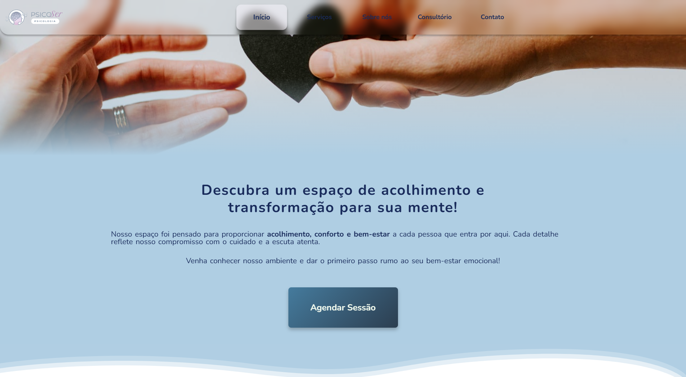
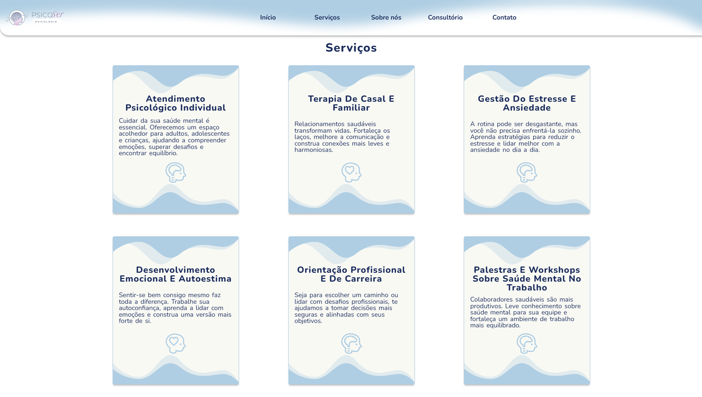
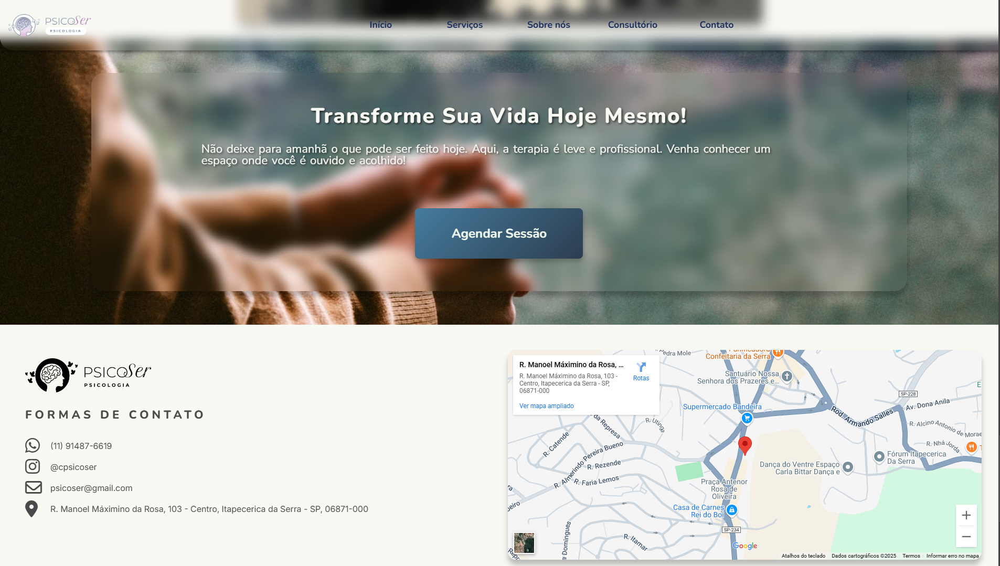

# 🚀 Landing Page - **PsicoSer**

Bem-vindo ao repositório da PsicoSer, minha primeira landing page real! 🎉 Este projeto foi desenvolvido com o objetivo de criar uma presença online profissional para um consultório psicológico e além disso praticar minhas técnicas em UX/UI design, HTML5 e CSS3.

## 🛠️ Tecnologias Utilizadas

- HTML5 - Estruturação semântica do conteúdo

- CSS3 - Estilização com foco em responsividade e acessibilidade

- JavaScript (ES6+) - Interatividade e manipulação do DOM

- Webpack - Empacotamento e otimização dos arquivos estáticos

## 📸 Imagem do Projeto

## 🌐 [Clique aqui para visualizar o projeto!](https://psicoser.vercel.app/)

